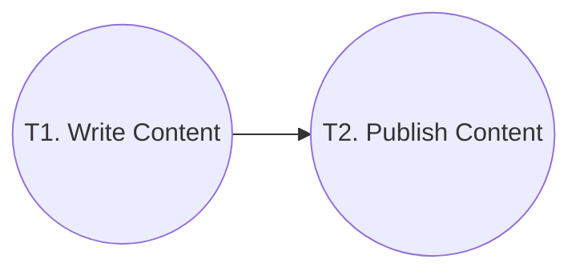

 [](https://discord.gg/dXmgggHYUz) [](https://youtu.be/6U42TgaR6RA?feature=shared)


# Lyzr Automata

## 1. Introduction

### A low-code multi-agent automation framework.

Note : Framework was developed swiftly as an experiment, leading to initial imperfections. We're committed to enhancing its stability and structure in upcoming releases, ensuring a high-quality. We encourage contributions from everyone, aiming to advance the project further together.

### [](https://github.com/LyzrCore/lyzr-automata#lyzr-automata---autonomous-multi-agent-framework-for-process-automation)Lyzr Automata - Autonomous Multi-Agent Framework for Process Automation

Lyzr Automata is a sophisticated multi-agent automation framework designed to keep things simple, with a focus on workflow efficiency and effectiveness. It enables the creation of multiple agents that are coupled with specific tasks. The agents and tasks can run independently and complete the provided instructions, thus entering a stable state.


## 2. Installation
You can install our package simply by running

    pip install lyzr-automata

## 3. Understanding fundamentals

To make things very simple, we have split our framework into fundamental building blocks.

 1. Models
 2. Agents
 3. Tools
 4. Tasks
 5. Pipelines


### 1. Models

Models are the core unit of the framework, which helps you connect different LLM or other AI Models to workflows.

Note: You can use our prebuilt model classes for **OpenAI and Perplexity** or extend our base **AIModel** class to provide support for your own models.

1.1 *Let's look at an example to create a **OpenAI Model** with parameters*
```python
from lyzr_automata.ai_models.openai import OpenAIModel

open_ai_text_completion_model = OpenAIModel(
    api_key="YOUR_OPEN_AI_KEY",
    parameters={
        "model": "gpt-4-turbo-preview",
        "temperature": 0.2,
        "max_tokens": 1500,
    },
)
``` 
					
1.2 *Let's look at an example to create a **Perplexity Model** with parameters*
```python
from lyzr_automata.ai_models.perplexity import PerplexityModel

perplexity_model_text = PerplexityModel(
    api_key="YOUR_KEY_HERE",
    parameters={
        "model": "pplx-70b-online",
    },
)

```
	

### 2.  Agents

Agents are directed specialists which have a set role, persona and memory, they are used to set direction and expertise for LLM models to increase its effectiveness.

2.1 *Let's look at an example to create a simple linkedin content creator agent.*

```python   
from lyzr_automata import Agent
    
linkedin_content_creator_agent = Agent(
        role="linkedin content creator",
        prompt_persona="you are an expert linkedin content creator who holds a Phd in molecular biology and are good at creating engaging linkedin posts."
    )
```

### 3.  Tools

Tools are used by Agents to complete tasks. In general sense tools help agents to connect with external software components like API's or other functions.

*Note: You can use our pre-built tools or tools from other providers like **Llama Hub**. Optionally you can also use our base **Tool** class to create your own custom tool by providing the function, input and output Pydantic models.*

*3.1 Let's look at an example to use prebuilt linkedin post tool*
```python
from lyzr_automata.tools.prebuilt_tools import linkedin_image_text_post_tool

linkedin_post_tool = linkedin_image_text_post_tool(
    owner="urn:li:person:<YOUR_ID_HERE>",
    token="YOUR_TOKEN_HERE",
)

```
*3.2 Let's look at an example to use our tool class to create your own custom tool*
 ##### 3.2 Step 1. Create a function
  
```python
     def multiply_numbers(a, b):
        """
        Multiply two numbers.
    
        Parameters:
        - a (int/float): The first number.
        - b (int/float): The second number.
    
        Returns:
        - int/float: The product of the two numbers.
        """
        return a * b
```
##### 3.2  Step 2. Create Pydantic input model

```python
#INPUT
from pydantic import BaseModel

class MultiplyInput(BaseModel):
	      a: float  # Assuming we want to allow floating point numbers
	      b: float
```
##### 3.2 Step 3. Create Pydantic output model
```python
#OUPUT
 class MultiplyOutput(BaseModel):
       result: float
  ```

#####  3.3 Step 4. Create a tool instance
```python
from lyzr_automata import Tool

    multiplication_tool = Tool(
		    name="Multiplication tool",
		    desc="multiplies two numbers",
		    function=multiply_numbers,
		    function_input=MultiplyInput,
		    function_output=MultiplyOutput,
	    )
```

### 4.  Tasks
Tasks are our smallest functioning unit/node that helps you define what do you want to get done by the agent. It combines agent & tools.

*4.1 Let's look at an example, on how you can define a task*

   
```python
from  lyzr_automata  import  Task
    
linkedin_content_writing_task = Task(

            name="linkedin content writing",
            agent=linkedin_content_writer_agent,
            output_type=OutputType.TEXT,
            input_type=InputType.TEXT,
            model=open_ai_model_text,
            instructions="Write a linkedin post on gene editing using CRISPR",
            log_output=True,
            enhance_prompt=False,
)
   ```
*4.1 Let's look at an example, on how you can create a tool task*

```python
	linkedin_post_task  =  Task(
			name="upload post to linkedin",
			model=open_ai_model_text,
			tool=linkedin_post_tool,
			instructions="Post on Linkedin",
	)
```

### 5.  Pipelines
Pipelines help us run the tasks in a directed orderly fashion. Currently we support linear async pipeline, with plans to release async DAG pipelines in next versions.

Let us look at a simple sync flow to create a pipeline for automated Linkedin post.
*5.1 **Flow***

5.2 **Code**

```python
from  lyzr_automata.pipelines.linear_sync_pipeline  import  LinearSyncPipeline

LinearSyncPipeline(
    name="Linkedin post automation pipeline",
    completion_message="post successfully posted 🎉",
    tasks=[
        linkedin_content_writing_task,
        linkedin_post_task,
    ],
).run()
```


**Example Colabs** 

1. Linkedin Post Automation: https://colab.research.google.com/drive/1lVJrdjHVZjbwZSqwJEU_etHC4GM3ihD0?usp=sharing
2. Blog Automation:
https://colab.research.google.com/drive/1e1Qa2pRjbngvX683pXTFLyuqLK11g967?usp=sharing#scrollTo=TmBixqI_BULu
### Join our community 
[](https://discord.gg/dXmgggHYUz)

## Contact
For queries, reach us at contact@lyzr.ai


